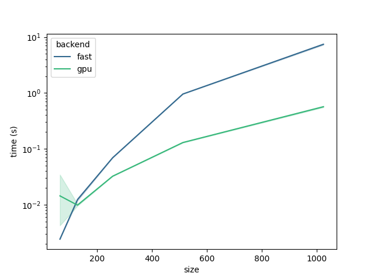

# MiniTorch Module 3


* Docs: https://minitorch.github.io/

* Overview: https://minitorch.github.io/module3.html


You will need to modify `tensor_functions.py` slightly in this assignment.

* Tests:

```
python run_tests.py
```

* Note:

Several of the tests for this assignment will only run if you are on a GPU machine and will not
run on github's test infrastructure. Please follow the instructions to setup up a colab machine
to run these tests.

This assignment requires the following files from the previous assignments. You can get these by running

```bash
python sync_previous_module.py previous-module-dir current-module-dir
```

The files that will be synced are:

        minitorch/tensor_data.py minitorch/tensor_functions.py minitorch/tensor_ops.py minitorch/operators.py minitorch/scalar.py minitorch/scalar_functions.py minitorch/module.py minitorch/autodiff.py minitorch/module.py project/run_manual.py project/run_scalar.py project/run_tensor.py minitorch/operators.py minitorch/module.py minitorch/autodiff.py minitorch/tensor.py minitorch/datasets.py minitorch/testing.py minitorch/optim.py


# Parallel Check
```
(.venv) (base) [huangf2@islogin01 mod3-fyng]$ python project/parallel_check.py
MAP

================================================================================
 Parallel Accelerator Optimizing:  Function tensor_map.<locals>._map,
/data1/tanseyw/projects/feiyang/mod3-fyng/minitorch/fast_ops.py (163)
================================================================================


Parallel loop listing for  Function tensor_map.<locals>._map, /data1/tanseyw/projects/feiyang/mod3-fyng/minitorch/fast_ops.py (163)
--------------------------------------------------------------------------------------|loop #ID
    def _map(                                                                         |
        out: Storage,                                                                 |
        out_shape: Shape,                                                             |
        out_strides: Strides,                                                         |
        in_storage: Storage,                                                          |
        in_shape: Shape,                                                              |
        in_strides: Strides,                                                          |
    ) -> None:                                                                        |
        # TODO: Implement for Task 3.1.                                               |
        if (out_strides == in_strides).all() and (out_shape == in_shape).all():-------| #0, 1
            for i in prange(len(out)):------------------------------------------------| #2
                out[i] = fn(in_storage[i])                                            |
        else:                                                                         |
            for i in prange(len(out)):------------------------------------------------| #3
                out_index = np.empty(len(out_shape), dtype=np.int32)                  |
                in_index = np.empty(len(in_shape), dtype=np.int32)                    |
                to_index(i, out_shape, out_index)                                     |
                broadcast_index(out_index, out_shape, in_shape, in_index)             |
                in_pos = index_to_position(in_index, in_strides)                      |
                out_pos = index_to_position(out_index, out_strides)                   |
                out[out_pos] = fn(in_storage[in_pos])                                 |
--------------------------------- Fusing loops ---------------------------------
Attempting fusion of parallel loops (combines loops with similar properties)...
Following the attempted fusion of parallel for-loops there are 4 parallel for-
loop(s) (originating from loops labelled: #0, #1, #2, #3).
--------------------------------------------------------------------------------
----------------------------- Before Optimisation ------------------------------
--------------------------------------------------------------------------------
------------------------------ After Optimisation ------------------------------
Parallel structure is already optimal.
--------------------------------------------------------------------------------
--------------------------------------------------------------------------------

---------------------------Loop invariant code motion---------------------------
Allocation hoisting:
The memory allocation derived from the instruction at
/data1/tanseyw/projects/feiyang/mod3-fyng/minitorch/fast_ops.py (177) is hoisted
 out of the parallel loop labelled #3 (it will be performed before the loop is
executed and reused inside the loop):
   Allocation:: out_index = np.empty(len(out_shape), dtype=np.int32)
    - numpy.empty() is used for the allocation.
The memory allocation derived from the instruction at
/data1/tanseyw/projects/feiyang/mod3-fyng/minitorch/fast_ops.py (178) is hoisted
 out of the parallel loop labelled #3 (it will be performed before the loop is
executed and reused inside the loop):
   Allocation:: in_index = np.empty(len(in_shape), dtype=np.int32)
    - numpy.empty() is used for the allocation.
None
ZIP

================================================================================
 Parallel Accelerator Optimizing:  Function tensor_zip.<locals>._zip,
/data1/tanseyw/projects/feiyang/mod3-fyng/minitorch/fast_ops.py (211)
================================================================================


Parallel loop listing for  Function tensor_zip.<locals>._zip, /data1/tanseyw/projects/feiyang/mod3-fyng/minitorch/fast_ops.py (211)
-------------------------------------------------------------------------------------------------------------------------------------------------------------------------------|loop #ID
    def _zip(                                                                                                                                                                  |
        out: Storage,                                                                                                                                                          |
        out_shape: Shape,                                                                                                                                                      |
        out_strides: Strides,                                                                                                                                                  |
        a_storage: Storage,                                                                                                                                                    |
        a_shape: Shape,                                                                                                                                                        |
        a_strides: Strides,                                                                                                                                                    |
        b_storage: Storage,                                                                                                                                                    |
        b_shape: Shape,                                                                                                                                                        |
        b_strides: Strides,                                                                                                                                                    |
    ) -> None:                                                                                                                                                                 |
        # TODO: Implement for Task 3.1.                                                                                                                                        |
        if np.array_equal(out_strides, a_strides) and np.array_equal(out_strides, b_strides) and np.array_equal(out_shape, a_shape) and np.array_equal(out_shape, b_shape):    |
            for i in prange(len(out)):-----------------------------------------------------------------------------------------------------------------------------------------| #4
                out[i] = fn(a_storage[i], b_storage[i])                                                                                                                        |
        else:                                                                                                                                                                  |
            for i in prange(len(out)):-----------------------------------------------------------------------------------------------------------------------------------------| #5
                out_index = np.empty(len(out_shape), dtype=np.int32)                                                                                                           |
                a_index = np.empty(len(a_shape), dtype=np.int32)                                                                                                               |
                b_index = np.empty(len(b_shape), dtype=np.int32)                                                                                                               |
                to_index(i, out_shape, out_index)                                                                                                                              |
                out_pos = index_to_position(out_index, out_strides)                                                                                                            |
                broadcast_index(out_index, out_shape, a_shape, a_index)                                                                                                        |
                a_pos = index_to_position(a_index, a_strides)                                                                                                                  |
                broadcast_index(out_index, out_shape, b_shape, b_index)                                                                                                        |
                b_pos = index_to_position(b_index, b_strides)                                                                                                                  |
                out[out_pos] = fn(a_storage[a_pos], b_storage[b_pos])                                                                                                          |
--------------------------------- Fusing loops ---------------------------------
Attempting fusion of parallel loops (combines loops with similar properties)...
Following the attempted fusion of parallel for-loops there are 2 parallel for-
loop(s) (originating from loops labelled: #4, #5).
--------------------------------------------------------------------------------
----------------------------- Before Optimisation ------------------------------
--------------------------------------------------------------------------------
------------------------------ After Optimisation ------------------------------
Parallel structure is already optimal.
--------------------------------------------------------------------------------
--------------------------------------------------------------------------------

---------------------------Loop invariant code motion---------------------------
Allocation hoisting:
The memory allocation derived from the instruction at
/data1/tanseyw/projects/feiyang/mod3-fyng/minitorch/fast_ops.py (228) is hoisted
 out of the parallel loop labelled #5 (it will be performed before the loop is
executed and reused inside the loop):
   Allocation:: out_index = np.empty(len(out_shape), dtype=np.int32)
    - numpy.empty() is used for the allocation.
The memory allocation derived from the instruction at
/data1/tanseyw/projects/feiyang/mod3-fyng/minitorch/fast_ops.py (229) is hoisted
 out of the parallel loop labelled #5 (it will be performed before the loop is
executed and reused inside the loop):
   Allocation:: a_index = np.empty(len(a_shape), dtype=np.int32)
    - numpy.empty() is used for the allocation.
The memory allocation derived from the instruction at
/data1/tanseyw/projects/feiyang/mod3-fyng/minitorch/fast_ops.py (230) is hoisted
 out of the parallel loop labelled #5 (it will be performed before the loop is
executed and reused inside the loop):
   Allocation:: b_index = np.empty(len(b_shape), dtype=np.int32)
    - numpy.empty() is used for the allocation.
None
REDUCE

================================================================================
 Parallel Accelerator Optimizing:  Function tensor_reduce.<locals>._reduce,
/data1/tanseyw/projects/feiyang/mod3-fyng/minitorch/fast_ops.py (263)
================================================================================


Parallel loop listing for  Function tensor_reduce.<locals>._reduce, /data1/tanseyw/projects/feiyang/mod3-fyng/minitorch/fast_ops.py (263)
---------------------------------------------------------------------|loop #ID
    def _reduce(                                                     |
        out: Storage,                                                |
        out_shape: Shape,                                            |
        out_strides: Strides,                                        |
        a_storage: Storage,                                          |
        a_shape: Shape,                                              |
        a_strides: Strides,                                          |
        reduce_dim: int,                                             |
    ) -> None:                                                       |
        # TODO: Implement for Task 3.1.                              |
        reduce_size = a_shape[reduce_dim]                            |
        reduce_stride = a_strides[reduce_dim]                        |
        for i in prange(len(out)):-----------------------------------| #6
            out_index = np.empty(len(out_shape), dtype=np.int32)     |
            to_index(i, out_shape, out_index)                        |
            out_pos = index_to_position(out_index, out_strides)      |
            out_index[reduce_dim] = 0                                |
            a_pos = index_to_position(out_index, a_strides)          |
            for j in range(reduce_size):                             |
                out[out_pos] = fn(out[out_pos], a_storage[a_pos])    |
                a_pos += reduce_stride                               |
--------------------------------- Fusing loops ---------------------------------
Attempting fusion of parallel loops (combines loops with similar properties)...
Following the attempted fusion of parallel for-loops there are 1 parallel for-
loop(s) (originating from loops labelled: #6).
--------------------------------------------------------------------------------
----------------------------- Before Optimisation ------------------------------
--------------------------------------------------------------------------------
------------------------------ After Optimisation ------------------------------
Parallel structure is already optimal.
--------------------------------------------------------------------------------
--------------------------------------------------------------------------------

---------------------------Loop invariant code motion---------------------------
Allocation hoisting:
The memory allocation derived from the instruction at
/data1/tanseyw/projects/feiyang/mod3-fyng/minitorch/fast_ops.py (276) is hoisted
 out of the parallel loop labelled #6 (it will be performed before the loop is
executed and reused inside the loop):
   Allocation:: out_index = np.empty(len(out_shape), dtype=np.int32)
    - numpy.empty() is used for the allocation.
None
MATRIX MULTIPLY

================================================================================
 Parallel Accelerator Optimizing:  Function _tensor_matrix_multiply,
/data1/tanseyw/projects/feiyang/mod3-fyng/minitorch/fast_ops.py (288)
================================================================================


Parallel loop listing for  Function _tensor_matrix_multiply, /data1/tanseyw/projects/feiyang/mod3-fyng/minitorch/fast_ops.py (288)
----------------------------------------------------------------------------|loop #ID
def _tensor_matrix_multiply(                                                |
    out: Storage,                                                           |
    out_shape: Shape,                                                       |
    out_strides: Strides,                                                   |
    a_storage: Storage,                                                     |
    a_shape: Shape,                                                         |
    a_strides: Strides,                                                     |
    b_storage: Storage,                                                     |
    b_shape: Shape,                                                         |
    b_strides: Strides,                                                     |
) -> None:                                                                  |
    """NUMBA tensor matrix multiply function.                               |
                                                                            |
    Should work for any tensor shapes that broadcast as long as             |
                                                                            |
    ```                                                                     |
    assert a_shape[-1] == b_shape[-2]                                       |
    ```                                                                     |
                                                                            |
    Optimizations:                                                          |
                                                                            |
    * Outer loop in parallel                                                |
    * No index buffers or function calls                                    |
    * Inner loop should have no global writes, 1 multiply.                  |
                                                                            |
                                                                            |
    Args:                                                                   |
    ----                                                                    |
        out (Storage): storage for `out` tensor                             |
        out_shape (Shape): shape for `out` tensor                           |
        out_strides (Strides): strides for `out` tensor                     |
        a_storage (Storage): storage for `a` tensor                         |
        a_shape (Shape): shape for `a` tensor                               |
        a_strides (Strides): strides for `a` tensor                         |
        b_storage (Storage): storage for `b` tensor                         |
        b_shape (Shape): shape for `b` tensor                               |
        b_strides (Strides): strides for `b` tensor                         |
                                                                            |
    Returns:                                                                |
    -------                                                                 |
        None : Fills in `out`                                               |
                                                                            |
    """                                                                     |
    a_batch_stride = a_strides[0] if a_shape[0] > 1 else 0                  |
    b_batch_stride = b_strides[0] if b_shape[0] > 1 else 0                  |
                                                                            |
    # TODO: Implement for Task 3.2.                                         |
    # only need to consider the 3D case                                     |
    d_shared = a_shape[-1]                                                  |
    for l in prange(len(out)):----------------------------------------------| #7
        j = l % out_shape[2]                                                |
        i = (l // out_shape[2]) % out_shape[1]                              |
        n = l // (out_shape[1] * out_shape[2])                              |
        acc = 0.0                                                           |
        out_pos = n*out_strides[0] + i*out_strides[1] + j*out_strides[2]    |
        for k in range(d_shared):                                           |
            a_pos = n*a_batch_stride + i*a_strides[1] + k*a_strides[2]      |
            b_pos = n*b_batch_stride + k*b_strides[1] + j*b_strides[2]      |
            acc += a_storage[a_pos] * b_storage[b_pos]                      |
        out[out_pos] = acc                                                  |
--------------------------------- Fusing loops ---------------------------------
Attempting fusion of parallel loops (combines loops with similar properties)...
Following the attempted fusion of parallel for-loops there are 1 parallel for-
loop(s) (originating from loops labelled: #7).
--------------------------------------------------------------------------------
----------------------------- Before Optimisation ------------------------------
--------------------------------------------------------------------------------
------------------------------ After Optimisation ------------------------------
Parallel structure is already optimal.
--------------------------------------------------------------------------------
--------------------------------------------------------------------------------

---------------------------Loop invariant code motion---------------------------
Allocation hoisting:
No allocation hoisting found
None
```

# Benchmarking GPU kernel



# Training
### Xor, GPU
1.24282 s / epoch
```
Epoch  0  loss  7.606973752102101 correct 29
Epoch  10  loss  3.251762970490556 correct 39
Epoch  20  loss  2.1073295228157143 correct 43
Epoch  30  loss  4.487163397363955 correct 42
Epoch  40  loss  2.373344542599007 correct 42
Epoch  50  loss  3.666515748604514 correct 43
Epoch  60  loss  3.229370248473582 correct 43
Epoch  70  loss  1.0313280260248394 correct 42
Epoch  80  loss  4.943927058305491 correct 43
Epoch  90  loss  0.8443951174289797 correct 46
Epoch  100  loss  1.3860359948753072 correct 46
Epoch  110  loss  2.4868464027253947 correct 44
Epoch  120  loss  3.993402774720548 correct 44
Epoch  130  loss  2.5970773614074676 correct 45
Epoch  140  loss  2.7368875981944334 correct 45
Epoch  150  loss  1.586617735528013 correct 46
Epoch  160  loss  1.5804694130284485 correct 46
Epoch  170  loss  3.2824219816422397 correct 46
Epoch  180  loss  3.5616439423304906 correct 45
Epoch  190  loss  2.38893992846609 correct 46
Epoch  200  loss  3.1530227561161923 correct 45
Epoch  210  loss  2.653417410268179 correct 44
Epoch  220  loss  2.0395252924645546 correct 46
Epoch  230  loss  2.7687970889979807 correct 47
Epoch  240  loss  0.813363523553894 correct 45
Epoch  250  loss  0.9601925975932784 correct 46
Epoch  260  loss  2.298919117409252 correct 46
Epoch  270  loss  1.2259038363098391 correct 47
Epoch  280  loss  2.426943322413329 correct 46
Epoch  290  loss  2.6418643287229493 correct 47
Epoch  300  loss  2.1405493120103625 correct 46
Epoch  310  loss  2.3869097095931315 correct 46
Epoch  320  loss  2.0695826580095282 correct 47
Epoch  330  loss  2.5606998208991425 correct 48
Epoch  340  loss  1.9407108158157782 correct 48
Epoch  350  loss  1.3444871344350555 correct 47
Epoch  360  loss  1.5969378059303223 correct 47
Epoch  370  loss  0.7828101245319518 correct 48
Epoch  380  loss  0.35536843920563416 correct 48
Epoch  390  loss  1.4611133278622062 correct 49
Epoch  400  loss  0.47621829248752784 correct 48
Epoch  410  loss  2.5637312673207413 correct 47
Epoch  420  loss  0.556937808238616 correct 49
Epoch  430  loss  2.262447831990096 correct 49
Epoch  440  loss  0.9359638450270463 correct 49
Epoch  450  loss  1.9046757469030866 correct 50
Epoch  460  loss  0.689400825923464 correct 49
Epoch  470  loss  0.086349682692014 correct 48
Epoch  480  loss  1.4430698934942061 correct 50
Epoch  490  loss  1.1594013035332968 correct 50
```
### Xor, CPU
0.081653 s / epoch
```
Epoch  0  loss  6.345680419808589 correct 34
Epoch  10  loss  4.991789146702867 correct 42
Epoch  20  loss  3.7857745680955515 correct 46
Epoch  30  loss  2.5450747224473838 correct 42
Epoch  40  loss  6.01564016936161 correct 40
Epoch  50  loss  2.166290758436773 correct 48
Epoch  60  loss  2.8261872550222193 correct 47
Epoch  70  loss  3.454589611924591 correct 45
Epoch  80  loss  1.6554167824476598 correct 48
Epoch  90  loss  1.9166370668746002 correct 50
Epoch  100  loss  0.7167001829817583 correct 49
Epoch  110  loss  1.908256314304782 correct 49
Epoch  120  loss  1.0569792432980514 correct 50
Epoch  130  loss  0.8166700848967362 correct 48
Epoch  140  loss  1.0889668059210609 correct 49
Epoch  150  loss  0.9382143326247214 correct 50
Epoch  160  loss  1.3712466142714816 correct 50
Epoch  170  loss  0.40169787629896503 correct 50
Epoch  180  loss  0.9211659725703216 correct 50
Epoch  190  loss  0.6400360161989714 correct 50
Epoch  200  loss  0.23752206157749273 correct 50
Epoch  210  loss  0.5090033527394157 correct 50
Epoch  220  loss  0.3715098132868435 correct 50
Epoch  230  loss  0.1765102424029877 correct 50
Epoch  240  loss  0.23335742126573292 correct 50
Epoch  250  loss  0.2606587011655109 correct 50
Epoch  260  loss  0.26088310913314794 correct 50
Epoch  270  loss  0.22197256250183364 correct 50
Epoch  280  loss  0.3191671590167824 correct 50
Epoch  290  loss  0.4346224150563877 correct 50
Epoch  300  loss  0.2304063533919945 correct 50
Epoch  310  loss  0.07544154785166479 correct 50
Epoch  320  loss  0.27688468599605776 correct 50
Epoch  330  loss  0.30836814180935007 correct 50
Epoch  340  loss  0.14104129850577132 correct 50
Epoch  350  loss  0.06902581532477806 correct 50
Epoch  360  loss  0.11508069691570495 correct 50
Epoch  370  loss  0.339928988127941 correct 50
Epoch  380  loss  0.23110788975877106 correct 50
Epoch  390  loss  0.2542805426484096 correct 50
Epoch  400  loss  0.0569199263437179 correct 50
Epoch  410  loss  0.12721366559452948 correct 50
Epoch  420  loss  0.17878142973732403 correct 50
Epoch  430  loss  0.08406518557797804 correct 50
Epoch  440  loss  0.26588029943166225 correct 50
Epoch  450  loss  0.31515819390669 correct 50
Epoch  460  loss  0.03440481578838659 correct 50
Epoch  470  loss  0.21924568203925962 correct 50
Epoch  480  loss  0.0782955348800882 correct 50
Epoch  490  loss  0.10538479168572146 correct 50
```

### Simple, GPU
1.28257 s / epoch
```
Epoch  0  loss  5.648723202574008 correct 31
Epoch  10  loss  3.2022379751907204 correct 50
Epoch  20  loss  0.9996818727266301 correct 50
Epoch  30  loss  2.266052615057608 correct 47
Epoch  40  loss  0.2214494791380231 correct 46
Epoch  50  loss  1.0930551203142507 correct 50
Epoch  60  loss  0.8371341220938775 correct 49
Epoch  70  loss  1.5044678785314758 correct 49
Epoch  80  loss  0.20511222855485944 correct 47
Epoch  90  loss  0.9137386842218991 correct 49
Epoch  100  loss  0.30932928637843676 correct 50
Epoch  110  loss  1.1333333064374538 correct 50
Epoch  120  loss  0.6993262766462123 correct 49
Epoch  130  loss  0.6944560474418645 correct 50
Epoch  140  loss  1.1276548776253301 correct 49
Epoch  150  loss  0.019847784407397543 correct 50
Epoch  160  loss  1.4543087817842728 correct 49
Epoch  170  loss  0.6248893683100654 correct 50
Epoch  180  loss  0.38532322896645876 correct 50
Epoch  190  loss  0.3159419215500427 correct 49
Epoch  200  loss  0.6648277751274193 correct 50
Epoch  210  loss  0.6578369748725733 correct 50
Epoch  220  loss  0.9452994346797563 correct 50
Epoch  230  loss  0.9973880841261847 correct 49
Epoch  240  loss  1.0406390683130489 correct 50
Epoch  250  loss  0.5157455073845826 correct 50
Epoch  260  loss  0.6159843379422323 correct 50
Epoch  270  loss  0.48058996518039226 correct 50
Epoch  280  loss  0.34564895489382474 correct 50
Epoch  290  loss  0.406557099523096 correct 50
Epoch  300  loss  0.5783589127579463 correct 50
Epoch  310  loss  0.1739392449988208 correct 50
Epoch  320  loss  0.14909899721230285 correct 50
Epoch  330  loss  0.15701674078083044 correct 50
Epoch  340  loss  0.08973001481113005 correct 50
Epoch  350  loss  0.7225503472095174 correct 50
Epoch  360  loss  0.10371185442213895 correct 50
Epoch  370  loss  0.010287670659958267 correct 50
Epoch  380  loss  0.5997175060886825 correct 50
Epoch  390  loss  0.09784274956081823 correct 50
Epoch  400  loss  0.4412700021412068 correct 50
Epoch  410  loss  0.14890014729917656 correct 50
Epoch  420  loss  0.5763181296281507 correct 50
Epoch  430  loss  0.05605787362678285 correct 50
Epoch  440  loss  0.03809090925383144 correct 50
Epoch  450  loss  0.0003190406441539413 correct 50
Epoch  460  loss  0.04651705834998616 correct 50
Epoch  470  loss  0.13031979755201206 correct 50
Epoch  480  loss  0.5389229393740315 correct 50
Epoch  490  loss  0.06193621335581381 correct 50
```
### Simple, CPU
0.08145 s / epoch
```
Epoch  0  loss  3.9971166363748334 correct 42
Epoch  10  loss  0.48097932105504243 correct 47
Epoch  20  loss  0.7239657714602139 correct 49
Epoch  30  loss  1.512059292891202 correct 49
Epoch  40  loss  0.9254380649254744 correct 50
Epoch  50  loss  1.6576772761890866 correct 49
Epoch  60  loss  0.9372297634084918 correct 50
Epoch  70  loss  0.12683181348610673 correct 50
Epoch  80  loss  0.36155484297763546 correct 49
Epoch  90  loss  0.18432558047900802 correct 50
Epoch  100  loss  0.36425031496600524 correct 49
Epoch  110  loss  0.41979498037081864 correct 49
Epoch  120  loss  0.036911055809030716 correct 49
Epoch  130  loss  0.44296758593801533 correct 50
Epoch  140  loss  0.7634583322793106 correct 50
Epoch  150  loss  0.6374649855687352 correct 50
Epoch  160  loss  0.1256544704534888 correct 49
Epoch  170  loss  0.8350706762995023 correct 49
Epoch  180  loss  0.33920403767361784 correct 50
Epoch  190  loss  0.0020900165685501107 correct 50
Epoch  200  loss  0.9873558875842433 correct 49
Epoch  210  loss  0.12585796762642493 correct 50
Epoch  220  loss  1.0490710146497615 correct 49
Epoch  230  loss  0.2338095093175287 correct 50
Epoch  240  loss  0.16745218005186183 correct 50
Epoch  250  loss  0.7730165326845504 correct 50
Epoch  260  loss  0.17022849499648585 correct 50
Epoch  270  loss  0.04364966342354308 correct 50
Epoch  280  loss  0.042347259434653596 correct 50
Epoch  290  loss  0.5782675434236234 correct 50
Epoch  300  loss  0.6335173186773019 correct 50
Epoch  310  loss  0.5967440228854973 correct 50
Epoch  320  loss  0.003681823753216326 correct 50
Epoch  330  loss  0.6386329618276492 correct 50
Epoch  340  loss  0.6315311611719286 correct 50
Epoch  350  loss  0.12636726745991916 correct 50
Epoch  360  loss  0.08952395533680181 correct 50
Epoch  370  loss  0.4691320661680569 correct 50
Epoch  380  loss  0.03273253672535629 correct 50
Epoch  390  loss  0.04377999401027798 correct 50
Epoch  400  loss  0.0030480577830737402 correct 50
Epoch  410  loss  0.8010922320025949 correct 50
Epoch  420  loss  0.0007920422986687079 correct 50
Epoch  430  loss  0.0717397070029991 correct 50
Epoch  440  loss  0.17473940212105274 correct 50
Epoch  450  loss  0.0017330197964977084 correct 50
Epoch  460  loss  0.041148275115596926 correct 50
Epoch  470  loss  0.031523421419785376 correct 50
Epoch  480  loss  0.05232418908266295 correct 50
Epoch  490  loss  0.023916883484787252 correct 50
```

### Split, GPU
1.292 s / epoch

```
Epoch  0  loss  10.23525624147804 correct 39
Epoch  10  loss  4.511194612980198 correct 40
Epoch  20  loss  3.524076327894046 correct 41
Epoch  30  loss  4.6127480406471655 correct 44
Epoch  40  loss  4.506167184827225 correct 45
Epoch  50  loss  5.057258367377555 correct 48
Epoch  60  loss  3.656325349062719 correct 47
Epoch  70  loss  2.127597668450872 correct 44
Epoch  80  loss  2.8605624876170888 correct 47
Epoch  90  loss  2.038462005493879 correct 49
Epoch  100  loss  2.415830393521836 correct 47
Epoch  110  loss  2.441418638963643 correct 48
Epoch  120  loss  1.9756328568074224 correct 46
Epoch  130  loss  1.6100189767841082 correct 48
Epoch  140  loss  1.1748456954448767 correct 49
Epoch  150  loss  0.6938986091104316 correct 47
Epoch  160  loss  0.7337666321171628 correct 49
Epoch  170  loss  1.5207962118071447 correct 50
Epoch  180  loss  0.9108098035125526 correct 50
Epoch  190  loss  1.9939243452769757 correct 49
Epoch  200  loss  1.6411015850587436 correct 48
Epoch  210  loss  3.0501056478648496 correct 43
Epoch  220  loss  0.657099281132302 correct 49
Epoch  230  loss  0.7696275325754044 correct 50
Epoch  240  loss  1.34137443998926 correct 49
Epoch  250  loss  0.2924906718088473 correct 49
Epoch  260  loss  0.5719984898715076 correct 50
Epoch  270  loss  0.8008536405573037 correct 47
Epoch  280  loss  1.4995046446464642 correct 49
Epoch  290  loss  0.2416956647976148 correct 48
Epoch  300  loss  0.4538061292898074 correct 48
Epoch  310  loss  0.8067245087223287 correct 50
Epoch  320  loss  0.8680213055110946 correct 50
Epoch  330  loss  0.27959583941779254 correct 49
Epoch  340  loss  0.1748622670381426 correct 50
Epoch  350  loss  0.6082067929228099 correct 50
Epoch  360  loss  1.8304286888949464 correct 49
Epoch  370  loss  1.6072063322666474 correct 49
Epoch  380  loss  1.0581969911931979 correct 49
Epoch  390  loss  0.25624111553311624 correct 49
Epoch  400  loss  0.29079450821769753 correct 48
Epoch  410  loss  0.3814047517754716 correct 50
Epoch  420  loss  2.334072441975066 correct 49
Epoch  430  loss  0.9653478934204457 correct 50
Epoch  440  loss  0.36016351650072254 correct 50
Epoch  450  loss  1.3142036411170037 correct 49
Epoch  460  loss  0.2994302920928559 correct 50
Epoch  470  loss  0.229745437233782 correct 49
Epoch  480  loss  0.4204198338660379 correct 50
Epoch  490  loss  1.1404073399928416 correct 50
```

### Split, CPU
0.0809 s / epoch

```
Epoch  0  loss  5.872593656745073 correct 34
Epoch  10  loss  5.312002942884171 correct 40
Epoch  20  loss  4.865198881571872 correct 39
Epoch  30  loss  4.985004928417091 correct 45
Epoch  40  loss  5.5705400493281605 correct 48
Epoch  50  loss  2.989101789915663 correct 47
Epoch  60  loss  5.338456996795806 correct 44
Epoch  70  loss  2.307956774368042 correct 42
Epoch  80  loss  1.0220459781511393 correct 43
Epoch  90  loss  2.087273543600985 correct 48
Epoch  100  loss  3.835692728577489 correct 48
Epoch  110  loss  2.8328812627371804 correct 47
Epoch  120  loss  1.0016519556699295 correct 42
Epoch  130  loss  2.0353949917748513 correct 47
Epoch  140  loss  2.7714044642565225 correct 47
Epoch  150  loss  1.8789301548314747 correct 48
Epoch  160  loss  2.4035821515017686 correct 48
Epoch  170  loss  1.41036670627881 correct 48
Epoch  180  loss  1.33838449159861 correct 49
Epoch  190  loss  2.251095359520077 correct 50
Epoch  200  loss  1.5954923663774934 correct 49
Epoch  210  loss  1.0842734337294198 correct 47
Epoch  220  loss  1.1651775181239958 correct 48
Epoch  230  loss  2.257944302486196 correct 49
Epoch  240  loss  1.9933699774667528 correct 47
Epoch  250  loss  0.7425899948537877 correct 49
Epoch  260  loss  0.8223461815627441 correct 50
Epoch  270  loss  0.9455525232239397 correct 50
Epoch  280  loss  1.4617055247594082 correct 50
Epoch  290  loss  1.2832636772073789 correct 50
Epoch  300  loss  1.0327336481754938 correct 50
Epoch  310  loss  0.485181123997642 correct 49
Epoch  320  loss  0.790357552207213 correct 49
Epoch  330  loss  1.1614783894610607 correct 50
Epoch  340  loss  0.8100467526747198 correct 50
Epoch  350  loss  0.7672728033385489 correct 50
Epoch  360  loss  0.4544982311064003 correct 50
Epoch  370  loss  0.7463316462089654 correct 49
Epoch  380  loss  0.7766632292133908 correct 50
Epoch  390  loss  1.2394864499078306 correct 50
Epoch  400  loss  0.9889286867282262 correct 49
Epoch  410  loss  1.453742503978558 correct 50
Epoch  420  loss  0.7671360148907371 correct 50
Epoch  430  loss  0.785624063401922 correct 50
Epoch  440  loss  0.6243808972579541 correct 49
Epoch  450  loss  1.0029985318254202 correct 50
Epoch  460  loss  0.3438798389464958 correct 50
Epoch  470  loss  0.10301384828720857 correct 50
Epoch  480  loss  0.365209742606523 correct 50
Epoch  490  loss  1.1428780594037096 correct 50
```

# Training (Large)
### Xor, GPU
1.3283 s / epoch

```
Epoch  0  loss  10.798133972088223 correct 24
Epoch  10  loss  2.4964009003430063 correct 47
Epoch  20  loss  3.623178774751537 correct 47
Epoch  30  loss  0.7254558663867843 correct 47
Epoch  40  loss  0.7490021452808248 correct 47
Epoch  50  loss  1.7563498808456532 correct 48
Epoch  60  loss  1.3998697651663508 correct 47
Epoch  70  loss  1.111597539818488 correct 47
Epoch  80  loss  1.5183639656823444 correct 48
Epoch  90  loss  2.6716830116813957 correct 46
Epoch  100  loss  2.3560640440406475 correct 48
Epoch  110  loss  0.2616823673821246 correct 48
Epoch  120  loss  2.04181690203991 correct 48
Epoch  130  loss  0.24061134179589155 correct 49
Epoch  140  loss  1.5196697171858204 correct 48
Epoch  150  loss  1.857132834678778 correct 49
Epoch  160  loss  0.21226270646122494 correct 48
Epoch  170  loss  1.1175805923338753 correct 48
Epoch  180  loss  0.8223740825272552 correct 48
Epoch  190  loss  1.3187068300310942 correct 48
Epoch  200  loss  0.6059053860390927 correct 49
Epoch  210  loss  0.018492085927274544 correct 49
Epoch  220  loss  1.917799349079577 correct 49
Epoch  230  loss  0.3502543883796849 correct 49
Epoch  240  loss  0.17100267001728625 correct 50
Epoch  250  loss  0.27696889603961816 correct 50
Epoch  260  loss  0.276859186514388 correct 50
Epoch  270  loss  0.29317713364682246 correct 49
Epoch  280  loss  0.9013524564974852 correct 50
Epoch  290  loss  0.4208465283800069 correct 49
Epoch  300  loss  0.9986570823909451 correct 50
Epoch  310  loss  0.006059085697656528 correct 50
Epoch  320  loss  0.1317961682189764 correct 50
Epoch  330  loss  0.22750611344732896 correct 50
Epoch  340  loss  0.5343624806977375 correct 50
Epoch  350  loss  0.850058015194622 correct 50
Epoch  360  loss  0.8543428707765028 correct 50
Epoch  370  loss  0.47027724308799845 correct 50
Epoch  380  loss  0.03609561943337087 correct 50
Epoch  390  loss  0.3563926583936804 correct 50
Epoch  400  loss  0.17907856342290396 correct 50
Epoch  410  loss  0.3996315211488998 correct 50
Epoch  420  loss  0.0905440812815925 correct 50
Epoch  430  loss  0.061923710207712035 correct 50
Epoch  440  loss  0.6923116570111467 correct 50
Epoch  450  loss  0.5287732654665426 correct 50
Epoch  460  loss  0.528254906943912 correct 50
Epoch  470  loss  0.07376312676392328 correct 50
Epoch  480  loss  0.18625115663981812 correct 50
Epoch  490  loss  0.5593572883947981 correct 50
```

### Xor, CPU
0.131438 s / epoch
```
Epoch  0  loss  8.948990443004634 correct 25
Epoch  10  loss  2.4659037411500933 correct 43
Epoch  20  loss  3.648258915279081 correct 47
Epoch  30  loss  2.604309797404133 correct 47
Epoch  40  loss  4.872851689329491 correct 45
Epoch  50  loss  2.9865747981284847 correct 48
Epoch  60  loss  1.4722527870145596 correct 49
Epoch  70  loss  2.4271430368596625 correct 48
Epoch  80  loss  1.9143975604031924 correct 49
Epoch  90  loss  2.950263941888784 correct 44
Epoch  100  loss  1.3623500975625158 correct 49
Epoch  110  loss  0.49325418790224546 correct 47
Epoch  120  loss  0.937730567517244 correct 49
Epoch  130  loss  0.8526896197860918 correct 49
Epoch  140  loss  1.9241809339228237 correct 49
Epoch  150  loss  2.0855135821699915 correct 47
Epoch  160  loss  2.066379833838533 correct 49
Epoch  170  loss  0.7543997214822268 correct 49
Epoch  180  loss  1.7122210706556167 correct 47
Epoch  190  loss  1.1456316251981493 correct 50
Epoch  200  loss  0.9542003804821564 correct 49
Epoch  210  loss  0.351459694902198 correct 50
Epoch  220  loss  0.6561084047703617 correct 50
Epoch  230  loss  0.034180728409391826 correct 49
Epoch  240  loss  0.14292727018736892 correct 49
Epoch  250  loss  0.6831106604192241 correct 49
Epoch  260  loss  0.24960840416856117 correct 49
Epoch  270  loss  0.3009439155225841 correct 49
Epoch  280  loss  0.19527370781340112 correct 49
Epoch  290  loss  1.1543679093677532 correct 50
Epoch  300  loss  0.63488063328846 correct 50
Epoch  310  loss  0.20690280002245795 correct 49
Epoch  320  loss  1.4708201258743672 correct 50
Epoch  330  loss  1.5851105436070785 correct 50
Epoch  340  loss  1.0810789669529353 correct 50
Epoch  350  loss  1.5009445815878015 correct 49
Epoch  360  loss  0.322804570192897 correct 50
Epoch  370  loss  0.6583788444444889 correct 49
Epoch  380  loss  0.4262971879714598 correct 50
Epoch  390  loss  0.2476509819880809 correct 49
Epoch  400  loss  0.48418346929091954 correct 50
Epoch  410  loss  1.0564215165219393 correct 50
Epoch  420  loss  0.5350324048747517 correct 50
Epoch  430  loss  0.26458155516978543 correct 50
Epoch  440  loss  0.17254672420123643 correct 50
Epoch  450  loss  0.31319268217840907 correct 49
Epoch  460  loss  0.1675701485182878 correct 50
Epoch  470  loss  0.9090188094812381 correct 50
Epoch  480  loss  0.15361929549273756 correct 50
Epoch  490  loss  0.20623805829825476 correct 50
```